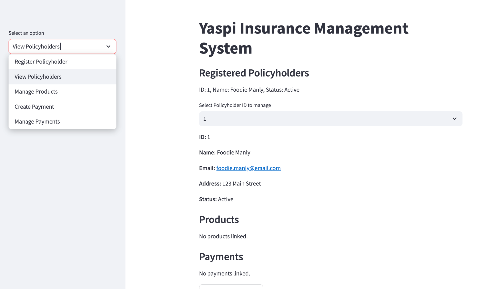

### Yaspi Policy Management System



This project is a simple mock-up for Yaspi insurance's policy management system to manage policyholders, products, and payments. The system allows policy managers to perform various tasks, such as adding and suspending policyholders, registering new members, and managing policy products. The simple application allows the system users to manage the members information. 

### Features

#### Policyholder Management:
* Register new policyholders.
* Suspend and reactivate policyholders.
* View detailed information about policyholders, including linked products and payments.

#### Product Management:

* Create new products (linked to policyholders).
* Update existing products.
* Remove or suspend products.
* Payment Management:

#### Create and process payments for policyholders.
* Send payment reminders.
* Apply penalties for overdue payments.

#### Policyholder Details:
* View policyholder details, including a list of purchased products and payment history.

### Pre-requisites
* Python 3.9.0
* Streamlit: For creating a web interface

### Installation
* Clone this repository:
```console
git clone https://github.com/your-repo/policy-management-system.git
cd policy-management-system
```
* Install dependencies:
```console
pip install -r requirements.txt
```
* Run the app:
```console
streamlit run main.py
```
### Folder Structure
```bash
policy-management-system/
├── images/  # Folder for images
│   └── cover.png
├── __pycache__/  # Auto-generated Python bytecode cache
│   ├── payments.cpython-39.pyc
│   ├── policyholder.cpython-39.pyc
│   └── product.cpython-39.pyc
├── main.py  # Main entry point for the Streamlit app
├── payments.py  # Payment management class and methods
├── policyholder.py  # Policyholder management class and methods
├── product.py  # Product management class and methods
├── README.md  # Project documentation
└── requirements.txt  # List of dependencies for the project
```

### Usage

#### Policyholder Management:

* Register a new policyholder with their details (first name, last name, address).
* Suspend or reactivate an existing policyholder.
* View detailed information for each policyholder, including products and payments.

#### Product Management:

* Create a new product (product ID, name, price).
* Link the product to a policyholder.
* Update or remove the product if necessary.

#### Payment Management:
* Create and process payments.
* Send reminders for unpaid invoices.
* Apply penalties for late payments.

### Deployment
The app has been deployed as a streamlit app available here: [https://yaspi-policy-management-system.streamlit.app/]

### Customization
This systems can be extended by adding new features, such as advanced search,reporting etc

### Contributing
Feel free to contribute by submitting a pull request or opening an issue on GitHub. Any contributions to improve the system are welcome.

### License
This project is licensed under the MIT License.

### Contact
For any questions or suggestions, feel free to reach out via email: [njuemugodominic@gmail.com]